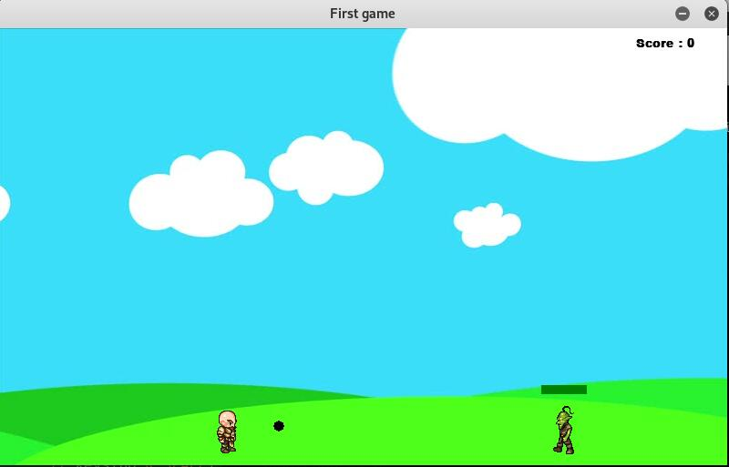

# No_name
This is a small game that I made in even not 24 hours with the python framwork (pygame), there are missing features that you can add and small bugs that we have to correct.
My main goal is to create a simulator for a deep learning project.
If you add a touch to this game, share it with us!

